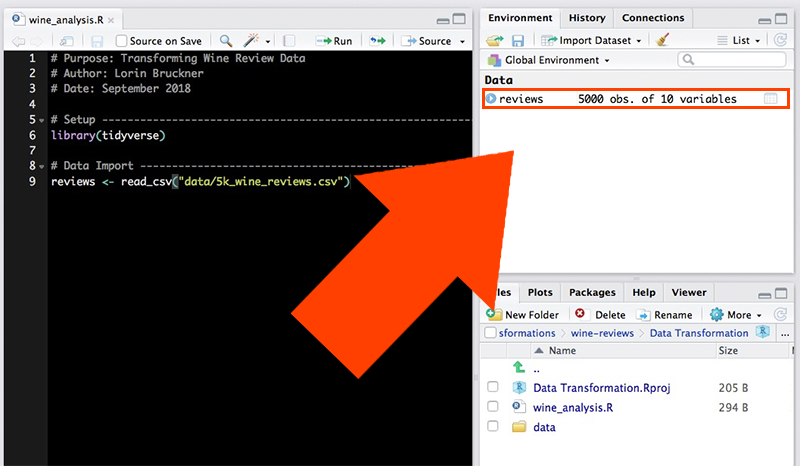
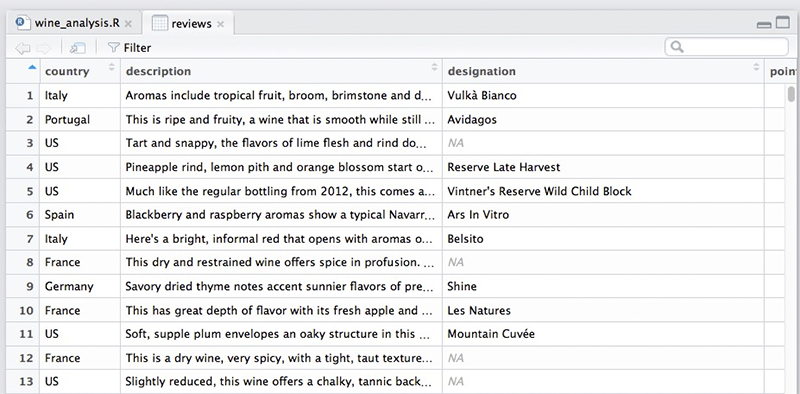
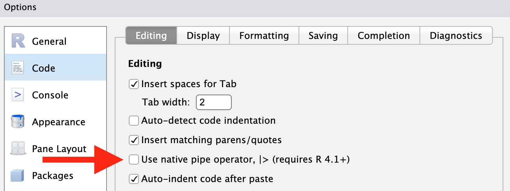

## Data and other downloads

[Five Thousand Wine Reviews](data/5k_wine_reviews.csv)

## Today

This workshop aims to cover:

-   Starting a New Project
    -   Creating directories (folders) and sub directories
    -   Loading the tidyverse
    -   Importing Data
-   Data Transformations
    -   Filtering Data
    -   Relational and Assignment Operators
    -   Reordering Data (arrange)
    -   Selecting Data
    -   Renaming Columns
    -   Adding new Variables (mutate)
    -   Summerising Data
-   Strings and Factors
    -   Combining and Subsetting Strings
    -   Regular Expressions
    -   Creating Factors
    -   Altering Factors

### Start a New Project in R

It is best practice to set up a new directory each time we start a new project in R. To do so, complete the following steps:

1.  Go to **File \> New Project \> New Directory \> New Project**.
2.  Type in a name for your directory and click **Browse**. Be sure to pick a place for your directory that you will be able to **find later**.
3.  Go to **Finder** on Mac or **File Explorer** on PC and find the directory you just created.
4.  Inside your project directory, create a new folder called **data**.
5.  Download or copy the **data file** (5k_wine_reviews.csv) into the data folder.
6.  Go to **File \> Save As** to give your R script a name and save it in your project directory.

### Loading the tidyverse

The first few lines of our R script are made up of comments to document the script's purpose, creator and date. Next, we use the `library()` function to load any packages that our script will need to run. In this workshop, we are using the **tidyverse** package for all of our projects.

```{r message=FALSE}
# Purpose: Transforming Wine Review Data
# Author: Nuvan Rathnayaka
# Date: January 2019

# Setup -----------------------------------------------------------
library(tidyverse)
```

## Importing Data

We use the `read_csv()` function to import our data.

```{r message=FALSE}
# Data Import ------------------------------------------------------
reviews <- read_csv("data/5k_wine_reviews.csv")
```

When we use `read_csv()`, our data is stored as a type of object in R called a **data frame**. One of the nice things about data frames is that we can see a visual representation of them using R Studio. Take a look at your **Environment tab** in the upper right and click on the **reviews** object you just created.

{width="800"}

The data will be represented as a table in a new tab.



## Filtering

We have a fairly big data set. What if we want to focus on certain records? For example, let's say I'm only interested in Chilean wine. I can use the `filter()` function to only look at wines with "Chile" as their country of origin.

```{r}
filter(reviews, country == "Chile")
```

When we use the `filter()` function on our reviews object, it displays the results in our **Console** tab. However, these results have not been saved, only displayed. If we want to save our results so we can perform additional transformations on them later, we need to **assign** them to a new data frame. Here, we'll name the data frame "chilean".

```{r}
chilean <- filter(reviews, country == "Chile")
```

Let's say I also don't have a lot of money to spend on wine, so I need to limit my data set to wines that cost \$20 or less. We should edit our filter to include a condition on price.

```{r}
chilean <- filter(reviews, country == "Chile", price <= 20)
```

Note that this time we are assigining the results to the **same** object we used before. This allows us to replace our previous data for that object with new data. Now, if we click on the "chilean" data frame in our Environment tab, we can see our data set has been limited only to wines from Chile that are \$20 or less.

## Relational and Assignment Operators

Our filter uses some symbols you may not be familiar with, such as `==` and `<=`. These are called **relational operators**. We use a relational operator to **check** the relationship between the two **operands** on either side of it.

| Operator | Relationship Check |
|:----------------:|------------------------------------------------------|
| `>` | Is the left operand **greater than** the right operand? |
| `<` | Is the left operand **less than** the right operand? |
| `>=` | Is the left operand **greater than or equal to** the right operand? |
| `<=` | Is the left operand **less than or equal to** the right operand? |
| `==` | Is the left operand **equal** to the right operand? |
| `!=` | Is the left operand **not equal** to the right operand? |

Above, you'll notice that we use `==` to **check** if something is equal. This is different from **defining** something as equal. To **set or assign** a value, we use either `=` or `<-` instead of `==`. For example:

| Use | Meaning |
|:-------------------------:|---------------------------------------------|
| `filter(reviews, country == "Chile")` | **Check** each review to see if the country is equal to "Chile" |
| `age = 52` | **Assign** the value 52 to a variable called "age" |
| `data <- survey_results` | **Assign** the contents of the object called "survey_results" to an object called "data". |

## Reordering Data (arrange)

Let's arrange the rows of our data frame in a way that's more informative. This time, we'll just take a look at the results in our console rather than assigning them to an object.

First, I want to know which wines in my Chilean data set get the highest number of review points. The `arrange()` function allows us to reorder our data by a particular variable. Below, we'll reorder by points.

```{r}
arrange(chilean, points)
```

Well, that sort of worked. My wines are reordered by points, but in ascending order. To reorder them in descending order, we need to use another function inside the arrange function. As you learned last week, this is called a nested function.

```{r}
arrange(chilean, desc(points))
```

Now we can see which wines have the highest number of points. But what if we want to reorder by **multiple** variables? For example, many wines with the same number of points have different prices. What if we wanted to reorder those wines by price as well, so we can see which wines have the highest reviews with the lowest prices? The `arrange()` function allows us to add multiple variables simply by using commas.

```{r}
arrange(chilean, desc(points), price)
```

## Selecting Data (select)

Most real world data sets we want to use in our research are going to be messy, and we'll need to go through a process of cleaning the data before we can start to explore and analyze it. The first steps in many data cleaning processes involve removing data that we don't need.

Going back to our original reviews data frame, let's imagine we are only interested in the country, province and variety of our wines. We could create a new object called "wine_types" using the `select()` function. We'll also **preview** our new object by simply typing its name and running the script.

```{r}
wine_types <- select(reviews, country, province, variety)
wine_types
```

But what if we have a lot of columns in our dataset and only need to remove one or two? Look at our chilean data frame again.

```{r}
chilean
```

You'll notice it has a columns which is no longer useful for us. The "country" column is the same for every row. Let's remove it using `select()`.

```{r}
chilean <- select(chilean, -country)

chilean
```

We use the - sign to indicate that we want a column to be removed.

Sometimes, we'll need to keep or remove a series of columns that are directly adjacent to each other in the data frame. In those circumstances, we can use the following syntax:

```{r}
# Keep columns "title" through "winery"
select(reviews, title:winery)
```

```{r}
# Remove columns "title" through "winery"
select(reviews, -c(title:winery))
```

In both cases the `:` symbol means "through" and allows us to select a series of columns at once.

## Renaming Columns

Renaming our columns is easy to do when we use the `rename()` function. We need to provide the new name we want to use first, and then **assign** the old name to it.

```{r}
chilean <- rename(chilean, review_points = points)
chilean
```

Above, we've changed the name of our "points" column to "review_points".

## Adding New Variables

My chilean data set has prices listed in USD, but suppose I also needed to know how many Euros each wine costs. Currently, the exchange rate is 0.85 Euros for every 1 USD. So, I just need to multiply the price column by 0.85, but how can I store the results of my currency conversion in a new column? The `mutate()` function makes that possible.

```{r}
chilean <- mutate(chilean, EUR = price * 0.85)
```

Now I'm going to make several more changes to my data set.

```{r}
# Rename the "price" column to "USD"
chilean <- rename(chilean, USD = price)

# Reorder the columns so that "USD" and "EUR" are adjacent
chilean <- select(chilean, description:review_points, USD, EUR, province:winery)

#Preview the results
chilean
```

Did I mention you can use `select()` to reorder columns as well? You can!

## Summarising Data

Now that we've done some cleaning of our data set, we can start to explore it a bit by taking a look at basic summary statistics with the `summarise()` function. One thing we need to remember when using `summarise()` is that missing data can cause a problem, so in many cases we will need to tell R to ignore rows with missing data using the `na.rm` parameter.

Let's take a look at the mean review points for all of our Chilean wines. We'll assign our result to a column named "mean_review_points".

```{r}
summarise(chilean, mean_review_points = mean(review_points, na.rm = TRUE))
```

A more informative approach might be to look at the mean number of points by province. To do that, we first need to create a new object using the group_by() function.

```{r}
by_prov <- group_by(chilean, province)
summarise(by_prov, mean_review_points = mean(review_points, na.rm = TRUE))
```

Now we want to arrange the results from highest to lowest review points, but that would require us creating **another** object to use `arrange()` on. Instead of creating many different objects that we don't necessarily need to keep around, let's use pipes.

## Piping

Pipes use the `|>` symbol to connect multiple functions without creating multiple objects. To use `group_by()`, `summarise()` and `arrange()` on our data all at once, we use the pipe like so:

```{r}
chilean |>
  group_by(province) |>
  summarise(mean_review_points = mean(review_points, na.rm = TRUE)) |>
  arrange(desc(mean_review_points))
```

To enable the keyboard shortcut, enable the checkbox under:

Tools \> Global Options \> Code \> Use native pipe operator, \|\> (requires R 4.1+)

{width="800"}

**Shortcut for \|\>:\
**CMD + SHIFT + m (Mac)**\
**CTRL + SHIFT + m (PC)

Not only do the pipes prevent us from having to create lots of objects, they also allow us to arrange the code in a way that is easier to read. Notice that we also only needed to name our object once, at the beginning of the sequence, for it to be used in every function onward.

Let's try another sequence of functions using the pipe to answer the following question: What is the highest price for each variety of wine in each province?

```{r}
chilean |>
  group_by(province, variety) |>
  summarise(max_price = max(USD, na.rm = TRUE)) |>
  arrange(province, variety, desc(max_price))
```

Note that some resources may use a different, older, pipe operator: `%>%`. This is known as [the magrittr pipe](https://tidyverse.org/blog/2023/04/base-vs-magrittr-pipe/), and in most instances will behave simliarly to `|>`.

### Strings and Factors

## Getting Started With Strings

Let's look at the Environment tab again. Notice the little blue arrow next to the reviews object. Clicking on it shows us what columns are available in the tibble. To the right of each column name is its **class**. We can get the same information using the `class()` function.

```{r}
class(reviews$province)
```

A **character** object in R contains strings, as in a *string* of characters. There are a number of functions and techniques for manipulating strings in R.

## Combining and Subsetting Strings

Our reviews dataset has a column for province and a column for country. What if we want to combine the two? We can use the `str_c()` function. Let's also use `mutate()` to create a new column called full_loc.

First, you'll notice that the street names and street numbers in this dataset are split into two different columns. If we want to combine them, .

```{r, message=FALSE, R.options=list(max.print=10)}
reviews_new <- reviews |> 
  mutate(full_loc = str_c(province, country))

head(reviews_new$full_loc)
```

Take a look at the results above. We have a problem! We need a space and a comma to separate the province and country. Luckily, we can add a parameter to `str_c()` that allows us to do that.

```{r, message=FALSE}
reviews_new <- reviews |> 
  mutate(full_loc = str_c(province, country, sep = ", "))

head(reviews_new$full_loc)
```

We can also subset portions of strings. Suppose we have a string that reads "Hello World" and we want to subset the word "Hello". We can use the `str_sub()` function, but we need to let it know the leftmost character and the rightmost character for the portion we want to subset.

In our "Hello World" string, H is our leftmost character. It also has the first position in the string. O is our rightmost character and it has the fifth position in the string. So, our `str_sub()` function looks like this:

```{r, message=FALSE}
str_sub("Hello World", 1, 5)
```

The winery column in our dataset includes the name of the winery along with a 6-digit id code surrounded by brackets. We need subset that code and put it in a separate column. Notice, however, that the code is at the **end** of the string rather than the beginning. 

Luckily, we can use a negative sign to indicate that we are counting backwards from the end of the string. However, we still need to put the parameters of the function in order from **leftmost character to rightmost character**. Remember to skip the brackets.

```{r, message=FALSE}
reviews_new <- reviews |> 
  mutate(winery_id = str_sub(winery, -7, -2))

head(reviews_new$winery_id)
```

Now that we've created a seperate column for the 6-digit code, we can remove it from the original winery column by subsetting out the winery name. Unfortunately, the winery name is variable in length. Since we don't know where the rightmost character will be for every winery name, how can we use `str_sub()`?

We know that the part of the string we want to remove is nine characters long: the six-digit code plus the brackets and a space. So, we just need to know the total length of the string minus nine characters. Thankfully, there is a function that counts the total number of characters in a string, `str_length()`. 

```{r, message=FALSE}
reviews_new <- reviews |> 
  mutate(winery = str_sub(winery, 1, str_length(winery) - 9))

head(reviews_new$winery)
```

## Regular Expressions

Often when we are working with text data, we will find that we have characters which follow a certain pattern. For example, a U.S. phone number commonly follows this pattern:

* three numbers
* dash
* three numbers
* dash
* four numbers

Likewise, an email address follows this one:

* some number of characters
* @
* some number of characters
* .com

It is often useful for us to be able to detect these patterns when working with strings. Many programming languages use a form of notation for describing these patterns called **regular expressions**. Some of the commonly used regular expressions in R are below.

Regular Expression | Pattern
---------|------------------
^        | start of string
$        | end of string
.        | match any character
[a-z]    | match any lowercase letter
[A-Z]    | match any uppercase letter
[0-9]    | match any number
[abc]    | match a, b OR c
[^abc]   | match anything EXCEPT a, b OR c
+        | perform the match one or more times
{x}      | perform the match x number of times

Additional patterns can be found on the [Regular Expressions Cheat Sheet](https://rstudio.github.io/cheatsheets/strings.pdf#page=2).

Let's try using them with some of our data. The title of each wine includes the vintage (the year the grapes were harvested) as well as the region. What if we want to know how many of the wines come from the Casablanca Valley and have a vintage in the 2010s? We'll use the `str_detect()` function with a regular expression. The expression first looks for the number "201" followed by another number between 0 and 9. That includes all years in the 2010 decade. Next, it matches any other character (.) any number of times (+) until it gets to the word "Casablanca".

```{r, message=FALSE, R.options=list(max.print=20)}
str_detect(reviews_new$title, "201[0-9].+Casablanca")
```

As you can see, `str_detect()` only supplies us with TRUE or FALSE depending on whether each string matches our regular expression. There are many functions in R that return these kinds of results. We can always combine them with the `table()` function to count the number of TRUE and FALSE outputs we get.

```{r, message=FALSE, R.options=list(max.print=20)}
table(str_detect(reviews_new$title, "201[0-9].+Casablanca"))
```

11 wines meet our criteria.

To actually see the strings that match our regular expressions, we need to use the `str_subset()` function.

```{r, message=FALSE, R.options=list(max.print=10)}
str_subset(reviews_new$title, "201[0-9].+Casablanca")
```
In the future, it might be more helpful to have the vintage of each wine in its own separate column. To do that, we'd need to follow several steps:

1. Create a new column with the `mutate()` function.
2. Develop a regular expression to find the vintage.
3. Subset the portions of the title that matches the regular expression using `str_extract()`.

Luckily, those three steps can be produced with minimal code.

```{r, message=FALSE}
reviews_new <- reviews_new |> 
  mutate(vintage = str_extract(title, "[0-9]{4}"))

head(select(reviews_new, title, vintage))
```

So far, we’ve only scratched the surface of regular expressions using some extremely simple examples. Regular expressions can become very complex. To see some regular expressions used in the real world, visit the [Regular Expression Library](http://regexlib.com/DisplayPatterns.aspx).

## Creating Factors

Let's take a look at how many wines fall into each of the review categories. Again, `table()` is helpful here.

```{r, message=FALSE}
table(reviews_new$review_category)
```

Now we want to plot these results on a simple bar chart like so:

```{r, message=FALSE}
ggplot(reviews_new, aes(review_category)) +
  geom_bar()
```

Our categories appear in alphabetical order in both the table and the bar chart. But What if we want to order our results from best to worst? To create ordered categories in R, we have to use **factors**. A factor is a separate class of object from characters, so we need to use a function to create one. 

```{r, message=FALSE}
reviews_new$review_category <- factor(reviews_new$review_category, 
                                   levels = c("Very good", "Good", "Mediocre", "Not recommended"))
class(reviews_new$review_category)
```

Notice the order we put our levels in above. That order will now be reflected in the bar chart and frequency table.

```{r, message=FALSE}
ggplot(reviews_new, aes(review_category)) +
  geom_bar()

table(reviews_new$review_category)
```

We may also want to combine our levels in some cases. Let's use `fct_collapse()` to create levels that simply indicate a "Good" or "Bad" result.

```{r, message=FALSE}
reviews_new$review_category <- fct_collapse(reviews_new$review_category, 
                                         "Good" = c("Very good", "Good"),
                                         "Bad" = c("Mediocre", "Not recommended"))

table(reviews_new$review_category)
```
## Exercises

Using our "reviews_new" data set, use the functions we learned this week to answer the following questions:

1.  What is the price and review score for the most expensive French wine?
2.  How many countries have wine that cost more than \$500?
3.  To which country and province should you travel to find the cheapest Tempranillo?
4.  You found a website that lets you order any wine for a flat shipping fee of \$15! Find the total price for each wine that includes shipping.
5.  The following code produces errors. Correct them all:

reviews \|\>\
select == (Title, province, country, price) \|\>\
filter (country = Germany) \>\
group_by (province) \|\>\
Summarise (mean_price == mean(price))

6. Create a new column for short descriptions called "desc_short". The strings in this column should follow this template: "[VINTAGE] [VARIETY] from [COUNTRY]."  
7. How many wineries have the word "Vineyard" in their name? *HINT: `table()` will come in handy again here.*
8. Find all wines that have the word "apricot" in their description. *HINT: You will need to use both `filter()` and `str_detect()` to accomplish this.*
9. Remove the region (in parentheses) from each title and put it in its own column.
10. R comes pre-loaded with a dataset called "diamonds". Store a copy of the dataset in your Global Environment with the following code:
```{r, message=FALSE}
diamonds <- diamonds
```
11. What class of object are the "cut", "color" and "clarity" columns?
12. What happens when you use the `min()` function on the the cut column? What happens when you use the `min()` function on the factor in your "insp_sm" dataset?
13. How can you create an ordered factor? Use the `?` function to read the documentation on factors.
14. [Read about the GIA diamond clarity grading scale here](https://en.wikipedia.org/wiki/Diamond_clarity#Clarity_grading). Alter the factor levels in the diamonds dataset to reflect the category names in the GIA scale (Flawless, Internally Flawless, etc.)
