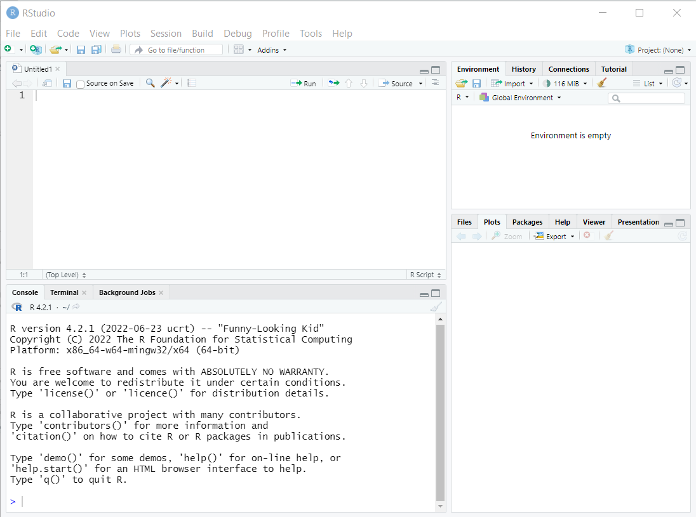
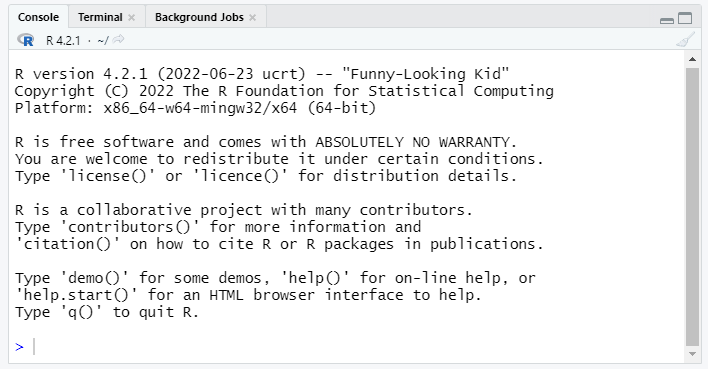
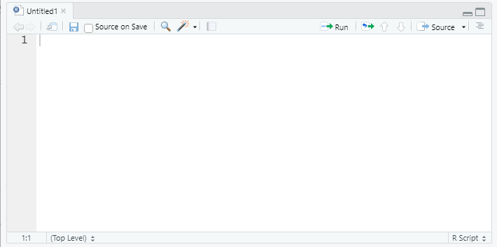
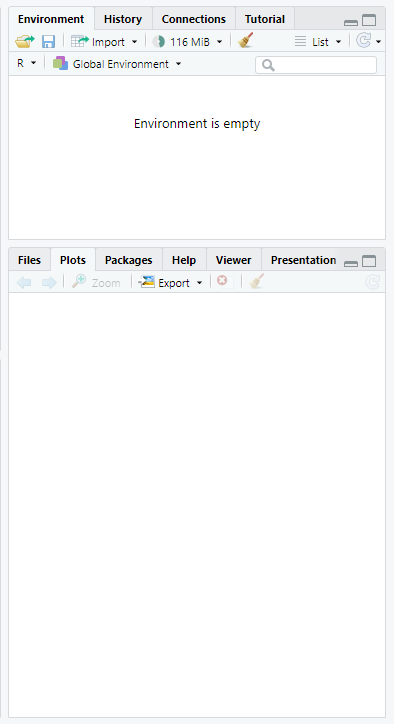
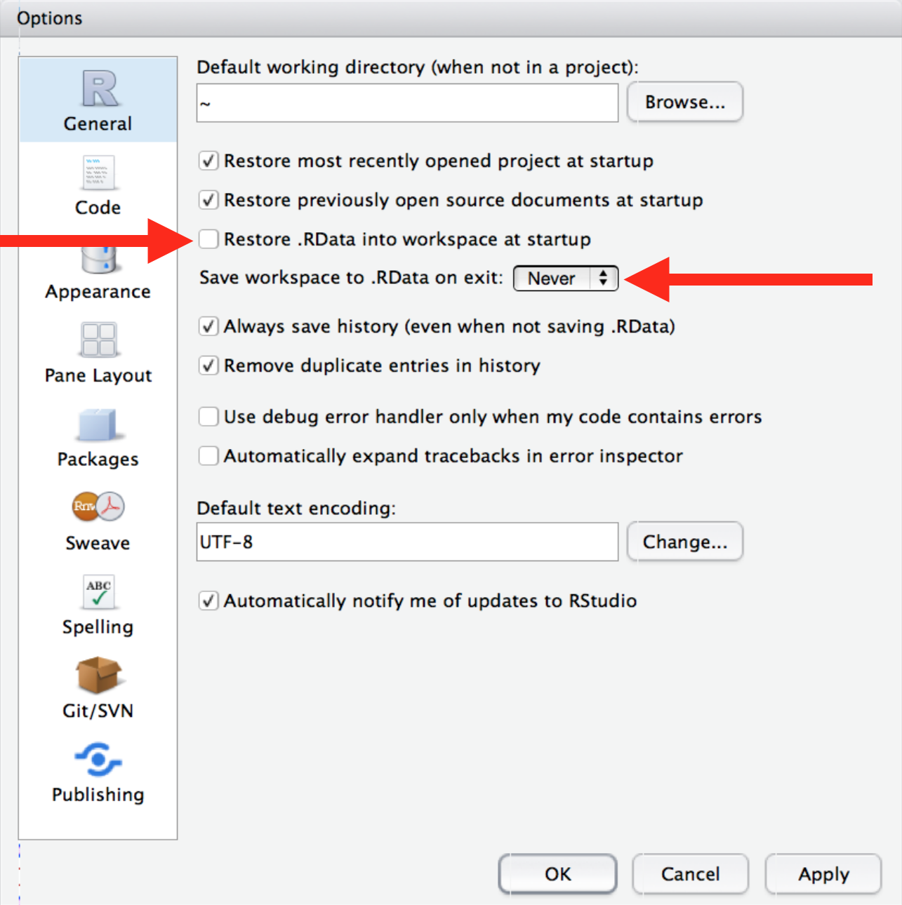

```{css, echo=F}
table td, table th, table tr { border: 1px black solid !important; color: black !important; } 
table td, table tr {text-align:left !important; font-size:14px; vertical-align:top !important;}
table th {text-align:center !important; font-size:15px; }
```

```{r echo=FALSE}
# Developed by Nuvan Rathnayaka (Fall 2018)
# Updated by Matt Jansen (Spring 2019)
# Updated by Nuvan Rathnayaka (Fall 2026)
```

## Why R?

R is widely used in statistics and has become quite popular in the biomedical and social sciences over the last decade. R can be used as either a programming language (like Python or Java) or as a standard statistical package (like Stata, SAS, or SPSS).

R is open source and free to use for any purpose. This has clear advantages and a few disadvantages:

Advantages

-   Free!
-   Portable (Windows, macOS, Linux)
-   [Interactive visualization](https://shiny.rstudio.com/gallery/)
-   [Reproducible reports](https://quarto.org/docs/gallery/)
-   Active user base
    -   Blogs, forums, StackOverflow, etc. provide many avenues of support
    -   Many new methods (e.g. [lasso regression](https://web.stanford.edu/~hastie/glmnet/glmnet_alpha.html), [Bayesian multilevel modeling](https://cran.r-project.org/web/packages/brms/vignettes/brms_phylogenetics.html), and [deep learning](https://tensorflow.rstudio.com/examples/)) quickly appear as R libraries

Disadvantages

-   No commercial support
    -   R is available free as is. If something doesn't exist or doesn't work the way you think it should you can wait for someone else to (hopefully) build it, or it's up to you
    -   No commercial hotline for help
    -   Support and libraries from other users varies by popularity of method/area of study.

## Learning objectives for the semester

R is a big tent that supports a variety of programming styles and tasks, so we can't possibly cover all of it. We will focus instruction on using R for analyzing data. If you are interested in software development in R, you can use the unstructured time for help with that. We'll also provide links to some great online resources for software development in R.

We are going to focus on the [Tidyverse](https://www.tidyverse.org/) family of R packages for data analysis. The authors of the Tidyverse have also written a free ebook, [R for Data Science](https://r4ds.hadley.nz/). We will not follow this book exactly, but for each of our workshops we will announce the corresponding chapters from the book, so you can have an additional perspective and practice on what we are teaching.

This workshop **does not** aim to give a comprehensive introduction to all aspects of R.

<!-- If you don't have any R experience, don't worry!  The Open Labs can provide support and a community to help you learn, **but** you may need to work outside the Open Labs to learn some of the basics.   -->

We also hope to empower you to become a self-sufficient R user, so we'll be showing you examples of how to troubleshoot and debug R code. Those of us who have used R regularly for years still troubleshoot, refer to documentation, and google error codes all the time!

## Learning Objectives for Today

This introductory workshop aims to cover:

* Install R and R Studio if you haven't already
* Briefly familiarize or re-familiarize you with some of the most important elements of R
    + RStudio interface
    + Tidyverse library
    + Data types
* Reproducible workflow
    + importing data
    + scripts
    + projects
    + saving output
* [R for Data Science Chapters 1,2,4,6](https://r4ds.hadley.nz/intro.html)


## Setup: R, R Studio

### Installation

+----------------------------------------------------------------------------------------------------------------------------------------------------+---------------------------------------------------------------------------------------------------------------------------+
| Mac Installation                                                                                                                                   | PC Installation                                                                                                           |
+====================================================================================================================================================+===========================================================================================================================+
| **Check your version number** and make sure to download the correct version of R/RStudio. Download R from <https://cran.r-project.org/bin/macosx/> | Download R from <https://cran.r-project.org/bin/windows/base/>                                                            |
|                                                                                                                                                    |                                                                                                                           |
| -   Choose the .pkg link                                                                                                                           | -   Install with default values                                                                                           |
| -   Install with default values                                                                                                                    |                                                                                                                           |
+----------------------------------------------------------------------------------------------------------------------------------------------------+---------------------------------------------------------------------------------------------------------------------------+
| Download R Studio at <https://posit.co/download/rstudio-desktop/#download>                                                                         | Download R Studio at <https://posit.co/download/rstudio-desktop/#download>                                                |
|                                                                                                                                                    |                                                                                                                           |
| -   Install with default values                                                                                                                    | -   Install with default values                                                                                           |
+----------------------------------------------------------------------------------------------------------------------------------------------------+---------------------------------------------------------------------------------------------------------------------------+
| **Optional:**                                                                                                                                      | **Optional:**                                                                                                             |
|                                                                                                                                                    |                                                                                                                           |
| -   Install XQuartz: <https://www.xquartz.org/>                                                                                                    | -   Install <https://cran.r-project.org/bin/windows/Rtools/>                                                              |
|                                                                                                                                                    |     -   Make sure to choose the Rtools version that matches your R installation                                           |
| -   For macOS **10.13 and higher**, install:                                                                                                       |     -   On the next page, click the link for the "Rtools\<xx\> installer" where \<xx\> is the appropriate version number. |
|                                                                                                                                                    |                                                                                                                           |
|     -   XCode: <https://apps.apple.com/us/app/xcode/id497799835>                                                                                   |                                                                                                                           |
|                                                                                                                                                    |                                                                                                                           |
|     -   gfortran: <https://github.com/fxcoudert/gfortran-for-macOS/releases>                                                                       |                                                                                                                           |
|                                                                                                                                                    |                                                                                                                           |
| -   For **earlier versions** of macOS:                                                                                                             |                                                                                                                           |
|                                                                                                                                                    |                                                                                                                           |
|     -   install \*\*clang\*\* and \*\*gfortran\*\* compatible with your version here: <https://cran.r-project.org/bin/macosx/tools/>               |                                                                                                                           |
+----------------------------------------------------------------------------------------------------------------------------------------------------+---------------------------------------------------------------------------------------------------------------------------+

### R Studio vs. Positron

Posit, the company that makes R Studio, has [created another integrated development environment (IDE) called Positron](https://positron.posit.co/migrate-rstudio-compare.html). Positron is built on VS Code, so if you have software development experience with VS Code, Positron may provide a more familiar user experience. If you have never used VS Code, have no fear! For these workshops, we are focusing on R Studio.

### R Studio orientation



#### Panes

R Studio shows four panes by default. The two most important for writing, testing, and executing R code are the console and the script editor.

##### Console (bottom left)



The console pane allows **immediate execution** of R code. This pane can be used to experiment with new functions and execute one-off commands, like printing sample data or exploratory plots.

Type next to the `>` symbol, then hit Enter to execute.

##### Script Editor (top left)



In contrast, code typed into the script editor pane **does not automatically execute**. The script editor provides a way to save the essential code for your analysis or project so it can be re-used or referred to for replication in the future. The editor also allows us to save, search, replace, etc. within an R 'script.' (This is much like the difference between using a Stata .do file and the main Stata window!)

The script should contain every necessary step in a data analysis; you should aim to be able to open and run a script in a new R session without relying on anything you've only run in the console. In contrast, the console is a great place to test code or run one-off checks of the data.

R Studio provides a few convenient ways to send code from the script editor to be executed in the console pane.

-   The **Run** button at the top right of the script editor pane provides several options.
-   One of the most useful is the **CTRL+Enter** (PC) or **CMD+Enter** (Mac) shortcut to execute whichever lines are currenly selected in the script editor
    -   If no complete lines are selected, this will execute the line where the cursor is placed.

##### Other Panes



The other panes provided in R Studio are provided to make some coding tasks easier. Some users hide these windows as they are less essential to writing code. Some of the most useful panes are:

-   **Environment** (top): Lists all objects and datasets defined in your current R session.

-   **Plots** (bottom): Displays plots generated by R code.

-   **Help** (bottom): Displays html format help files for R packages and functions

-   **Files** (bottom): Lists files in the current working directory (more on this later!)


### Loading the tidyverse

First, we need to load the tidyverse package. (Note, the terms package and library are interchangeable). You can install the library using the install.packages command or through the Packages tab on the lower right pane. Once you have it installed, you can load this library with the following code:

```{r tidyverse, warning=FALSE}
#install.packages("tidyverse", dependencies=TRUE)
library(tidyverse)
```

You only have to install a package once, but you'll need to load it each time you start a new R session.

**Note:** `install.packages("tidyverse", dependencies=TRUE)` is a great candidate to run in the console window, since you only need to run it once and it won't be needed again. `library(tidyverse)` has to be run before using the tidyverse package, so it is probably necessary in your script!


## What is reproducibility?

1. Scientific reproducibility - if you repeat my experiment, you will get the same results as me. This is beyond the scope of this workshop ([see here for an overview](https://en.wikipedia.org/wiki/Replication_crisis))

2. Computational reproducibility - if I give you my data and code, you will get the same results as me. We'll focus on the basics of computational reproducibility today.

### Why does computational reproducibility matter?

1. **Your most important collaborator is you six months from now.**
2. We want Science (with a capital S) to be self-correcting. Since you're human, you will make mistakes, so you want to make it as easy as possible for others to catch your errors (see [the Reinhart and Rogoff Excel error](https://theconversation.com/the-reinhart-rogoff-error-or-how-not-to-excel-at-economics-13646) and [the Guinea worm wars](https://www.cgdev.org/blog/mapping-worm-wars-what-public-should-take-away-scientific-debate-about-mass-deworming) for recent examples)

### Your script is real, your environment is not

For your results to be reproducible, **every** step you take to manipulate the data should be explicitly documented in an R script.

This also means that you want to make sure that your results don't have hidden/implicit dependencies in **your** R environment. There are two steps you can to take to prevent this.

1. Reconfigure RStudio not to save your workspace between sessions. (Tools > Global Options > General)


dio-workspace.png)

2. Restart RStudio from scratch and rerun the current script often.
    + Cmd/Ctrl + Shift + F10 to restart RStudio
    + Cmd/Ctrl + Shift + S to rerun the current script

**Note:** If you have learned R in the past, you may have been taught to use the expression `rm(list = ls())` to clear your R environment. [This will not actually return R to a blank slate!](https://community.rstudio.com/t/first-line-of-every-r-script/799/12) Although this code will delete objects in your R environment, it won't reset global settings that have been changed. It is always safer and more effective to restart RStudio.

## Data and other downloads
[Airbnb listings from Washington DC ](data/listings.csv)

## 1: RStudio Projects

You can use the R function `setwd()` to point to locations of data files, but this isn't ideal for reproducible research. When you switch between computers, it is likely that the **absolute** directory path will change, so you will have to modify the path for each computer. Users of your code will not have the same absolute directory path that you have, so they will have to modify the path in the `setwd()` function before they can use your code.

RStudio Projects provide a way to bundle together data, code, and other files together so that you can refer to files with **relative** directory paths, which creates a much more portable structure that won't need to be modified between computers or users.

### Configuration

1. File > New Project > New Directory > New Project
2. Create a new subdirectory called "data" inside this project to store the data.
3. Copy the Airbnb data (listings.csv) into this data directory
4. Create a new R Script for the data analysis in this project. (File > New File > R Script)

## 2: Import the data

We'll begin by loading the tidyverse library. This library includes readr, which we will use to read in our data file (for more details on readr, see Chapter 11 of the text).

RStudio has a useful keyboard shortcut for **<-** (the assignment operator): **Alt + -**, i.e. press the Alt key and the minus/hyphen key at the same time.

```{r import}
# Purpose: Exploratory data analysis of airbnb data
# Author: Nuvan Rathnayaka
# Date: September 2018

# Setup -----------------------------------------------------------
library(tidyverse)

# Data Import ------------------------------------------------------
airbnb_dc <- read_csv("data/listings.csv") #Since I'm using an RStudio project, I only have to specify the path relative to the top directory

#If you have problems running the read_csv above, the following code should also work
#(Download data directly from the internet)
#airbnb_dc <- read_csv(url("https://unc-libraries-data.github.io/beginR/week2_Workflow/data/listings.csv"))

```

### Comments 

In R, the # symbol indicates the beginning of a comment. Everything to the right of that is ignored by R, so you can write plain text to document what you're doing, organize your code, and explain any tricky or unusual steps.


### Headers and code folding

As you start developing more complicated analyses, a single R script can get rather long.
Breaking up the code into sections using comments makes it easier to read and navigate.
If you create a line of code formatted like this:

`# section name ----`

The RStudio interface recognizes that as a code chunk and lets you hide/unhide that section. You can nest these code chunks by adding additional `#` signs like this:

`# section name ----`

`## subsection name ----`

### Coding conventions

Something that I've glossed over is that you have options for how to name objects. For example, we called our imported data **airbnb_dc**, but we could have called it **airbnbListings**, or **airbnb.listings**

Having a consistent way you name objects and functions helps you remember what things are called. It's especially useful when you're working with others to agree upon a coding convention. It doesn't particularly matter which one you choose, as long as you choose a convention and **stick to it**.

Example style guide: http://style.tidyverse.org/index.html

### What is airbnb_dc? `library()`? `read_csv()`?

Unlike other popular statistical software, R is an object oriented programming language, similar to other popular languages such as Java, Python, Ruby, or C++.

`airbnb_dc` is an **object**. Specifically, it's a type of object called a `data frame`. It is designed to represent two-dimensional data, much like a spreadsheet. There are other kinds of R objects that are used to represent data, such as the `vector` that is used to represent one-dimensional columns of data, but the data frame is the one we'll most often be using in the our analyses. 

[Read more about data structures here](http://adv-r.had.co.nz/Data-structures.html)

`library()` and `read_csv`()` are **functions**. We'll learn more about these as we go along, but for now, it may be useful to think of objects as nouns and functions as verbs.


### Useful data frame functions
The `dim()` function will print the dimensions (rows x columns) of your data frame.

`head()` will print the first few rows of your data frame.
`glimpse()` transposes the data.frame for easier printing of similar output.

(Note: `str()` is a general purpose function similar to `glimpse` that will display the structure of an object, often including extra information. This can be useful for debugging.)

```{r useful}
# Some useful functions  ----------------------------------------
dim(airbnb_dc)
head(airbnb_dc)
glimpse(airbnb_dc)
```


## 3: Analyze the data

In the next few weeks we will provide more detailed instruction on the tidyverse tools for analyzing data. Here are a few examples of the kinds of things you can do.

### Exploring categorical data

We can use the `table()` function to view counts/frequencies of categorical variables.

```{r tables}
# Categorical Variables  ----------------------------------------
table(airbnb_dc$property_type)
```

If you want to do a more complicated computation, you can also nest functions within each other. Here, let's generate a contingency table using `table()`, then sort it by count using `sort()`.

```{r table2}
sort(table(airbnb_dc$property_type), decreasing=TRUE)
```

That works, but it's a little hard to read. We could try breaking this into two steps and storing our intermediate output.

```{r table3}
property_type_table <- table(airbnb_dc$property_type)
sort(property_type_table, decreasing = TRUE)
```

This works ok, but it does mean we're creating an additional object, `property_type_table`, and we could end up with lots of objects that are trivially different from each other if we do this too often. In the next lesson, we'll introduce the pipe operator, which makes this kind of nested computation easier to read.

### Exploring continuous data
R has built-in functions to compute the mean, standard deviation, min, median, and max.

```{r continuous1}
# Continuous Variables  ----------------------------------------

mean(airbnb_dc$price)
sd(airbnb_dc$price)
min(airbnb_dc$price)

median(airbnb_dc$price)

max(airbnb_dc$price)

```

### Missing data

There are some missing values in the review_scores_rating and reviews_per_month columns, even within the first six rows. We can check which values of review_scores_rating are NA with `is.na()`

```{r missing}
# Continuous Variables  ----------------------------------------


sum(is.na(airbnb_dc$review_scores_rating)) #summing a logical (TRUE/FALSE) vector counts the number of TRUE values
```

We can check all of our columns using R's `colSums` to sum all of the columns at the same time.

```{r missing data2}

colSums(is.na(airbnb_dc))

```

Handling missing data is an advanced topic that is a bit beyond the scope of this lesson. There is no good way to handle missing data, there are only bad and less bad ways. 

One of the bad ways to handle missing data is what's known as a complete case analysis. In this kind of analysis, you only keep observations (rows) where you have observed (non-missing) values for ALL columns. 

R has built-in functions to facilitate this:

* `complete.cases` returns a logical vector indicating whether or not an entire row of a dataset contains any missing values.  You can also use this function on a subset of columns to determine if only those columns are complete

* `na.omit` returns a new dataframe with only the complete cases (as identified above)

For most R functions, the default is to return NA is any of the values are NA:

```{r mean}
mean(airbnb_dc$review_scores_rating)
```

Some functions, like the linear regression function `lm()`, perform a complete-case analysis automatically:

```{r lm}
lm(review_scores_rating~price, data=airbnb_dc)
```

When a function complains about missing values and fails, there's usually an argument that can be modified to change it to a complete-case analysis:

```{r mean2}
mean(airbnb_dc$review_scores_rating, na.rm=TRUE)
```

## 7: Saving output

Suppose, we've done some computation, and we want to save our modified dataframe. We can use `write_csv()` to save our dataset as comma separated values file.

```{r writing}

airbnb_dc$price_gt_500 <- (airbnb_dc$price > 500)
write_csv(airbnb_dc, "data/modified_airbnb.csv")
```


## Exercises

1. What are the different types of cancellation policies offered at Airbnb?
2. What is the most common and least common cancellation policy?
3. What percent of Airbnb property types are houses? Hint: To find what percent of X is Y, use this formula: Y/X * 100
4. How many listings get a review rating below 50?
5. Try installing the visdat library, and explore different ways to visualize missing data.

## Resources

### Beginners

Review today's material by reading [R for Data Science Chapters 1,2,4,6](https://r4ds.hadley.nz/intro.html). Try the exercises in these chapters for additional practice.

Next week, we'll be covering the material in Chapter 3 if you'd like to look ahead!

### Additional resources on reproducibility

[Why setwd() is bad practice](https://tidyverse.org/blog/2017/12/workflow-vs-script/)

[Concise guide to basic computational reproducibility](https://kbroman.org/steps2rr/)

[Eight things you can do to make your open science more understandable](http://datacolada.org/69)

[A detailed guide to reproducible workflows in collaborative settings](http://journals.plos.org/ploscompbiol/article?id=10.1371/journal.pcbi.1005510)


### Other Resources

**Quick References**

[Tidyverse Cheatsheets](https://www.rstudio.com/resources/cheatsheets/)

**Useful R Packages:**

[CRAN Task Views](https://cran.r-project.org/web/views/)

[Quick list of useful packages](https://support.rstudio.com/hc/en-us/articles/201057987-Quick-list-of-useful-R-packages)

**Advanced R Books:**

[ggplot2](http://had.co.nz/ggplot2/)

[Advanced R](http://adv-r.had.co.nz/)

[R packages](http://r-pkgs.had.co.nz/)

[Efficient R](https://csgillespie.github.io/efficientR/)

**Statistical Modeling Textbooks:**

[An Introduction to Statistical Learning](https://www.statlearning.com/)

[Regression Modeling Strategies](https://www.springer.com/us/book/9783319194240)

[Statistical Rethinking](https://xcelab.net/rm/statistical-rethinking/)

**Misc:**

<https://github.com/ujjwalkarn/DataScienceR>


## Feedback

You'll receive an automated email with feedback information after the workshop!
