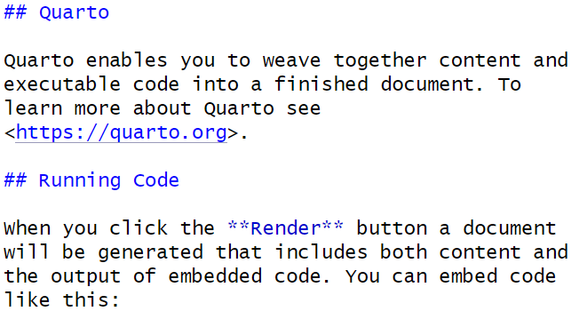

## Data and other downloads

[North Carolina Kickstarter Data](data/Kickstarter_nc.csv)

## Today

This workshop aims to cover:

-   Reproducible Reports using Quarto
-   Exploratory Data Analysis (EDA)
    -   Basic summaries
    -   ggplot
    -   Univariate EDA
        - Categorical Variables
        - Visualization for EDA
        - Continuous Variables
    -   Bivariate EDA
        - Continuous vs Continuous
        - Categorical vs Categorical
        - Categorical vs Continuous
        - Correlations between numeric/logical variables
        
-   [R for Data Science Chapter 27](https://r4ds.hadley.nz/quarto)
-   [R for Data Science Chapter 10](https://r4ds.hadley.nz/EDA.html)

## Reproducible Reports using Quarto

Quarto provides a straightforward way to create reports that combine code and the output from that code with text commentary. This allows for the creation of automated, reproducible reports. Quarto can knit together your analysis results with text and output it directly into HTML, PDF, or Word documents. In fact, we have been using Quarto to generate the webpage for all of our R Open Labs workshops!

### Note: R Markdown

Quarto is very similar to an older tool, R Markdown, that these workshops were originally created in. Quarto and R Markdown syntax and behind the scenes functionality are similar, but Quarto is designed to be more compatible with other languages like Python and Julia. In most cases, you can convert old R Markdown .Rmd documents into Quarto documents with no changes.

### Quarto Structure

Quarto has three components.

1.  An (optional) header in a language called YAML. This allows you to specify the type of output file and configure other options.
2.  R code chunks wrapped by ```` ``` ````
3.  Text mixed with simple formatting markup.

To create a new Quarto document (.qmd), select File -\> New File -\> Quarto Document.

You will have the option to select the output: we'll use the default HTML for this workshop. Give the document a title and enter your name as author: this will create the header for you at the top of your new .html page! RStudio will create a new Quarto document filled with examples of code chunks and text.

#### Header

```{verbatim}
---
title: "beginR: Joining, Reshaping & Reproducible Reports"
author: 
  name: University of North Carolina at Chapel Hill
execute:
  echo: true
format: 
  html:
    theme: spacelab
    toc: true
    toc-location: left
    page-layout: article
---
```

At the top of the page is the optional Yet Another Markup Language (YAML) header. This header is a powerful way to edit the formatting of your report (e.g. figure dimensions, presence of a table of contents, identifying the location of a bibliography file).

#### Code Chunks

````{verbatim}
```{r}
#| label: setup
#| warning: false
library(tidyverse)
```
````

R code chunks are surrounded by ```` ``` ````. Inside the curly braces, it specifies that this code chunk will use R.

`#|` precedes options for this code chunk.  In this case:

* `#| label: setup` names this chunk "setup". (Names are optional)
* `#| warning: false` tells Quarto to hide any warnings generated by our code in the final HTML document.

Finally the code `library(tidyverse)` is executed as usual.  When creating a document, you can use the buttons at the top right of the code chunk to run all code before and run the code in this block respectively.  

Use CTRL+ALT+i (PC) or CMD+OPTION+i (Mac) to insert R code blocks.

#### Formatted Text

````{verbatim}
## Quarto

Quarto enables you to weave together content and executable code into a finished document. To learn more about Quarto see <https://quarto.org>.

## Running Code

When you click the **Render** button a document will be generated that includes both content and the output of embedded code. You can embed code like this:
````



This is plain text with simple formatting added. The `##` tells Quarto that "Quarto" and "Running Code are section headers. The `**` around "Render" tells Quarto to make that word **bold**.

The Posit team has helpfully condensed these code chunk and text formatting options into a [cheatsheet](https://rstudio.github.io/cheatsheets/quarto.pdf).

You can get pretty far with options in the Quarto cheatsheet, but Quarto is a very powerful, flexible language that we do not have time to fully cover. More detailed references are available here: <https://quarto.org/docs/authoring/markdown-basics.html>

#### Visual Editor

R Studio provides a visual editor for Quarto documents. This can be accessed by toggling between the "Source" and "Visual" options in the top left corner of your Qmd script editor pane.

Once activated, this interface is similar to a word processing software like Microsoft Word - shortcuts for bolding, italics, etc. are usually the same and there are icons and drop down menus available for lists, bullets, links, and more.

You can still use CTRL+ALT+i (PC) or CMD+OPTION+i (Mac) to insert R code blocks, or use the Insert\>Code Chunk\>R menu in the visual editor.

Read more about the visual editor here:\
<https://quarto.org/docs/visual-editor/>

## Generating the HTML document

Click the **Render** button, and R Studio will generate an HTML report based on your document.

Let's try creating an Quarto document to explore US cheese consumption data.

````{verbatim}
### Data Import

```{r}
consumption <- read_csv("https://unc-libraries-data.github.io/beginR/Join_Reshape_Reports/data/clean_cheese.csv")
```

### Useful functions for exploring dataframes

Include one of the following in your document. We've used `eval = FALSE` here to prevent this code chunk from running!

```{r}
#| label: misc
#| eval: FALSE
head(consumption)
tail(consumption)
summary(consumption)
```

### Tables and `knitr::kable`

By default, Quarto will display tables the way they appear in the R console. We can use `knitr::kable function` to get cleaner tables.

```{r}
#| label: kable
knitr::kable(head(consumption), caption = "The first six rows of the cheese consumption data")
```

### Adding a new variable

We've covered two ways to add a new variable to a dataframe.

**Note:** R allows non-standard variable names that include spaces, parentheses, and other special characters. The way to refer to variable names that contain wonky symbols is to use the backtick symbol `` ` ``, found at the top left of your keyboard with the tilde `~`.

The base R way covered in lesson 1 using the `$` operator and `with()` function

```{r}
#| label: ratio1
#| error: TRUE
#Base R way, covered in lesson 1
consumption$amer_ital_ratio <- with(consumption, `Total American Cheese` / `Total Italian Cheese`)
```

Oops. Better check the variable names.

```{r}
#| label: ratio2
consumption$amer_ital_ratio1 <- with(consumption, `Total American Chese` / `Total Italian Cheese`)
```

The tidyverse way covered in lesson 3 using the `mutate()` function

```{r}
#| label: ratio3
#Tidyverse way, covered in lesson 3
consumption <- mutate(consumption, amer_ital_ratio2 = `Total American Chese` / `Total Italian Cheese`)
```

### Selecting Columns

```{r}
#| label: select
consumption <- select(consumption, Year, Cheddar, Mozzarella, `Cream and Neufchatel`)

```

### Renaming Columns

```{r}
#| label: rename
consumption <- rename(consumption, Cream_and_Neufchatel = `Cream and Neufchatel`)
```

### Plotting

```{r}
#| label: plot1
#| fig.width: 8
#| fig.height: 5
ggplot(consumption, aes(x = Year)) + 
    geom_point(aes(y = Cheddar, col = "Cheddar")) + 
    geom_point(aes(y = Mozzarella, col = "Mozzarella")) + 
    geom_point(aes(y = Cream_and_Neufchatel, col = "Cream and Neufchatel")) +
    ylab("Consumption in Pounds Per Person")

```
````

### Bibliography

Quarto also provides a nifty way to incorporate a bibliography and references. We'll haven an example of this in the exercises, but here's a brief summary of the steps required to use a BibTex bibliography.

1.  Create a plain-text .bib file in the same directory as your .qmd document.
2.  Fill that .bib file with BibTex citations. Many academic databases or the [Citation Machine](http://www.citationmachine.net/bibtex/cite-a-book) can generate the BibTex citations for you.
3.  Make sure each citation has a unique citation-key, the first entry
4.  Add a bibliography field to the YAML header that tells Quarto the name of your bibliography file, for example `bibliography: references.bib`
5.  Add citations throughout the document using square brackets.

## Reminders and Notes: 
### Start a New Project in R

It is best practice to set up a new directory each time we start a new project in R. To do so, complete the following steps:

1. Go to **File > New Project > New Directory > New Project**. 
2. Type in a name for your directory and click **Browse**. Be sure to pick a place for your directory that you will be able to **find later**.
3. Go to **Finder** on Mac or **File Explorer** on PC and find the directory you just created.
4. Inside your project directory, create a new folder called **data**.
5. Download or copy the **data file** (Boston_kstarter.csv) into the data folder.
6. Go to **File > Save As** to give your R script a name and save it in your project directory.


## What is Exploratory Data Analysis?

Exploratory Data Analysis (EDA) is the process of exploring your data, focused on discovering patterns rather than statistical testing.  [*R for Data Science*](https://r4ds.hadley.nz/EDA.html) breaks this down into three steps:

> 1. Generate questions about your data.
> 2. Search for answers by visualizing, transforming and modelling your data.
> 3. Use what your learn to refine your questions and/or generate new questions.

This process can be repeated many times.

## What do we have? - `dim`, `str`, and `summary`

Before we start asking questions of our dataset, we need to determine the basic contents of the dataset.

```{r, warning=FALSE, message=FALSE}
library(tidyverse)

kstarter <- read_csv("data/Kickstarter_nc.csv")

dim(kstarter)
```

We have 18 variables (columns) across 1609 observations (rows).

### Note: Indexing

In R, we can use square brackets, `[]`, to quickly select a subset of rows and/or columns by position using numeric indices. Unlike some programming languages, R starts counting positions at 1 instead of zero.

For example, if we want to look at row 7, column 2 of our kstarter data frame, we can do it like so:

```{r}
kstarter[7,2]
```

There are a number of different ways we can use indexing to subset our data:

```{r, results="hide"}
kstarter[,1] # column 1
kstarter[,7:10] # columns 7 through 10
kstarter[,c(1,8,11)] # columns 1, 8 and 11
kstarter[2,] # row 2
kstarter[3:9,] # rows 3 through 9
kstarter[c(7,10),] # rows 7 and 10
```

For a vector, we only need one number to describe position:

```{r}
myvec <- c("a","b","c","d","e","f","g")
myvec
myvec[1]
myvec[4:7]
myvec[c(1,3,7)]
```

### `str` and `summary` (with Indexing)

We can use `str` and `summary` to learn more about each of these 36 variables. We'll use indexing to get results for only the first three columns with `str`

```{r}
str(kstarter[,1:3])
```

The equivalent way to do this using dplyr and the `|>` we learned earlier would be:

```{r}
kstarter |>
  select(id:creator_name) |>
  str()
```

We'll use `summary` with the 6th, 10th, and 13th columns.

```{r}
summary(kstarter[,c(6,10,13)])
```

To get the same results using dplyr and the |>, we could use:

```{r}
kstarter |>
  select(category_name, goal, backers_count) |>
  summary()
```

## Frequency - Univariate EDA

A natural starting place for EDA is learning more about individual variables.  We're often interested in the relative frequency of different values of a given variable.

### Categorical Variables

> What are the most common categories of Kickstarters in North Carolina?

#### `table`

`table` provides a simple frequency table for a categorical (usually factor or character) variable.  

```{r}
table(kstarter$category_parent_name)
```

Games are the most popular types of Kickstarter projects in North Carolina, with Publishing and Comics coming in second and third.

#### Visualization for EDA

Representing our data visually can be a very useful way to explore it. One of the most popular visualization packages in R is ggplot2. The "gg" in ggplot stands for "Grammar of Graphics". ggplots are built by first creating a plot object, then adding **layers** to it.

When building a plot object, we need to determine how our variables will be mapped to the different visual properties of the plot. This is done using the `aes()` function. `x` and `y` arguments inside `aes` allow us to choose which variables will exist on the X and Y axes. Next, we add layers to the plot. Layers include visual elements like lines, bars, dots and text labels, along with more abstract elements like scales, facets and themes. 

We will try out different types of ggplots as we continue our EDA. To learn more, you can read about the [Grammar of Graphics](https://ggplot2-book.org/mastery.html) or check out the [ggplot cheatsheet](https://rstudio.github.io/cheatsheets/data-visualization.pdf).

#### Bar Charts with `geom_bar`

We can represent categorical variables with a bar chart, using a ggplot with a `geom_bar` layer. `geom_bar`requires us to provide only one categorical variable as an aesthetic (x for vertical bars or y for horizontal ones) then plots frequency on the other axis.

```{r}
ggplot(data = kstarter, aes(y = category_parent_name)) +
  geom_bar()
```

Using `fct_infreq` will quickly re-arrange our categories to be plotted in frequency order. I've also used `labs` layers to provide better labels for our axes.

```{r}
ggplot(data = kstarter, aes(y = fct_rev(fct_infreq(category_parent_name)))) +
  geom_bar() +
  labs(
    y = "Kickstarter Categories",
    x = "Number of Projects"
  )
```

### Continuous Variables

> How many music projects have lots of backers?

Unfortunately, with continuous variables, we usually have too many distinct values to make a table or bar chart useful.

```{r}
kstarter |> 
  filter(category_parent_name == "Music") |> 
  ggplot(aes(y = backers_count)) +
    geom_bar()
```

#### Histograms with `geom_hist`

A common way to overcome this problem is to bin values into ranges with a histogram.

```{r}
kstarter |> 
  filter(category_parent_name == "Music") |> 
  ggplot(aes(x = backers_count)) +
    geom_histogram(bins = 20) +
    theme_bw()
```

It's important to note that a histogram can look very different depending on how many ranges or "bins" we use. 

```{r echo=FALSE,message=FALSE}
library(gridExtra)
kstarter_m <- kstarter |> filter(category_parent_name == "Music")
p1 <- ggplot(data=kstarter_m,aes(x=backers_count))+geom_histogram(bins=10)+theme_bw()+ggtitle("10 bins")
p2 <- ggplot(data=kstarter_m,aes(x=backers_count))+geom_histogram(bins=50)+theme_bw()+ggtitle("50 bins")
p3 <- ggplot(data=kstarter_m,aes(x=backers_count))+geom_histogram(bins=100)+theme_bw()+ggtitle("100 bins")
grid.arrange(p1,p2,p3,nrow=1)
```

#### Boxplots with `geom_boxplot`

The boxplot provides another convenient summary of a continuous variable. Adding a theme layer to this plot changes its overall appearance - in this case, providing more contrast.

```{r}
kstarter |> 
  filter(category_parent_name == "Music") |> 
  ggplot(aes(x = backers_count, y = category_name)) +
    geom_boxplot() +
    theme_bw()
```

* The box of the boxplot ranges from the 25th to the 75th percentile, and therefore contains half of the observed data. The line running down the middle of the box is the median. 

* The difference between the 25th and 75th percentiles, the width of the box, is known as the inter-quartile range (IQR).

* The lines extending out to the left and right of the box represent the furthest extent of datapoints that are within 1.5 IQR of the box. 

* Finally, the points represent outliers.

### Outliers

Outliers are data that are "far" away from your other observations in terms of one or more variables.  There are a number of frequently used cutoffs to help identify outliers in continuous variables.

However, there is no fixed rule as to when you should remove an observation you have identified as an outlier.  In general, you want to remove observations that aren't really in the population you're studying.  This includes values that may have been entered in error or produced by malfunctioning sensors or equipment. In other cases, a suprirsing, but accurate, outlying value, can be the most important result.  **Observations shouldn't be removed just because they're outliers**.

## Covariation - Two or more variables

Once we have a handle on single variables in our dataset, we can start hypothesizing about relationships between variables.

### Continuous vs Continuous

> Does having more backers always mean more money pledged?

The most common way to explore the interaction between two continuous variables is with a scatterplot, using `geom_point`.

```{r warning=FALSE}
kstarter |> 
  ggplot(aes(x = backers_count, y = pledged)) +
    geom_point() +
    theme_bw()
```

As in many large datasets, we have so many points in certain areas that it can be hard to tell how many observations are actually represented.  We can get a better sense of how many observations are in a given area by adding some transparency, using the `alpha` aesthetic of `geom_point`.

```{r warning=FALSE}
kstarter |> 
  ggplot(aes(x = backers_count, y = pledged)) +
    geom_point(alpha = 0.08) +
    theme_bw()
```

For comparison, let's zoom in on the grid where projects have less than 5,000 backers and received less than $500,000:

```{r echo=FALSE}

options(scipen = 999) #turn off scientific notation

p1 <- kstarter |> 
  filter(backers_count < 5000, pledged < 500000) |> 
  ggplot(aes(x = backers_count, y = pledged)) +
    geom_point() +
    theme_bw()

p2 <- kstarter |> 
  filter(backers_count < 5000, pledged < 500000) |> 
  ggplot(aes(x = backers_count, y = pledged)) +
    geom_point(alpha = 0.08) +
    theme_bw()

grid.arrange(p1, p2, nrow = 1)
```
We can see that most projects receive less than $50,000 and have less than 500 backers. But, we can also find projects that received large sums from small amounts of backers, and projects with many backers that did not pledge much money!

## Categorical vs Categorical

> Which categories of projects most often exceed their goal?  

We can use `table` with two variables to get a quick summary.

```{r}
table(kstarter$category_parent_name, kstarter$goal_exceeded)
```

We can represent this graphically in a number of ways. For example, we can use `geom_count` to plot points sized by frequency. This has the benefit of avoiding overlapping points.  

```{r }
kstarter |>
  ggplot(aes(x = goal_exceeded, y = category_parent_name)) +
  geom_count() +
  scale_size_area(max_size = 8) +
  theme_bw()
```

## Categorical vs Continuous

> What type of publishing projects have the largest goals on average?

Let's continue looking at room types, but lets compare a continuous variable, prices, across the categories.  Recall that we can use `group_by` and `summarize` from earlier to get a summary table:

```{r}
kstarter |> 
  filter(category_parent_name == "Publishing") |> 
  group_by(category_name) |>
  summarize(mean_goal = mean(goal), median_goal = median(goal))
```

However, we'll usually get a better sense of the data with a visualization such as a boxplot.

```{r}
kstarter |> 
  filter(category_parent_name == "Publishing") |> 
  ggplot(aes(x = goal, y = category_name)) + 
    geom_boxplot() +
    theme_bw()
```

We can control the order of boxplots with `reorder`.  `reorder(category_name, goal, median)` will reorder the categories of publishing projects based on median goal. Below, we've also filtered out publishing projects without a category name.

```{r}
kstarter |> 
  filter(category_parent_name == "Publishing" & !is.na(category_name)) |> 
  ggplot(aes(x = goal, y = reorder(category_name, goal, median))) + 
  geom_boxplot() +
  theme_bw()
```

Unfortunately, for histograms, we already have counts on the y axis by default, so we'll use facets instead. Facets allow you to create multiple plots - one for each level of a categorical variable.

```{r}
kstarter |> 
  filter(category_parent_name == "Publishing") |> 
  ggplot(aes(x = goal)) + 
  geom_histogram(bins = 20) +
  facet_wrap(vars(category_name)) +
  theme_bw()
```

To place several histograms in one overlapping plot, we should to convert the bar representation into lines, to make overlaps easier to see and understand.  We'll use the `color` aesthetic to separate our categories.

*`geom_freqpoly` represents each histogram as a line plot through the top of each bar.  We'll use the `size` parameter for `geom_freqpoly` to make the lines a little thicker than the default.

```{r message=FALSE, warning=FALSE}
kstarter |> 
  filter(category_parent_name == "Publishing") |> 
  ggplot(aes(x = goal, color = category_name)) +
    geom_freqpoly(bins = 20, linewidth = 1)+
    theme_bw()
```

#### Correlations between numeric/logical variables

> Does a project being featured affect whether or not it does well?

If we want to look for correlations between variables, we can use the `cor()` function. This will only work with numeric variables, however the function will automatically convert logical variables to numeric.

```{r}
kstarter_cm <- kstarter |> 
  select(where(is.numeric) | where(is.logical), -id) |> 
  cor()

kstarter_cm
```
`cor()` outputs a matrix that shows us the correlation coefficient for every possible pair of variables. This output can be easier to read if we first convert it to a table, then a dataframe.

```{r}

kstarter_cdf <- kstarter_cm |> 
  as.table() |> 
  as.data.frame() |> 
  rename(Coef = Freq)

head(kstarter_cdf)

```

Making those conversions also creates an dataframe that can be visualized using `geom_tile()`. `geom_tile()` allows us to produce a nicely organized correlation matrix with a color scale, also called a "heatmap".

```{r}

ggplot(kstarter_cdf, aes(Var1, Var2, fill = Coef)) +
  geom_tile() +
  geom_text(aes(label = round(Coef, 2)), color = "white") +
  theme_bw() +
  theme(axis.text.x = element_text(angle = 90, hjust = 1))

```

Looking at the heatmap, we can see that being chosen as a "staff pick" has a weak affect on pledges and backers and whether or not a project reaches or exceeds its goal. However, if a project is chosen as a "spotlight", it is very likely to reach and exceed its goal!

## Review

1. One Variable

* (Catetgorical) `table` and `geom_bar` with `x` aesthetic
* (Continuous) `geom_hist` with `x` aesthetic
* (Continuous) `geom_boxplot` with `y` aesthetic

2. Two Variabes

* (Continuous - Continuous) `geom_point` with `x` and `y` aesthetics
* (Categorical - Categorical) `table` or `geom_count` with `x` and `y` aesthetics
* (Categorical - Continuous) 
      + `geom_boxplot` with `y` (continuous) and `x` (categorical) aesthetics
      + `geom_histogram` with `x` (continuous) aesthetic and `facet_grid` using the categorical variable
      + `geom_freqpoly` with `x` (continuous) and `color` (categorical) aesthetic
      + `geom_density` `x` (continuous) and `color` (categorical) aesthetic

## Exercises

1. [Download the cheese RStudio Project](https://unc-libraries-data.github.io/beginR/Join_Reshape_Reports/download/cheese.zip) file and extract the R Project contained within. Then, render the cheeseConsumption.qmd report. It should generate an HTML report for you.

2. In the cheeseConsumption.qmd file, find the code chunk named **setup**. change `#| echo: FALSE` to `#| echo: TRUE`. Try knitting the document again. What changed? Did this affect the whole document?

3. In the cheeseConsumption.qmd file, find the code chunk named **import**. change `#| message: FALSE` to `#| message: TRUE`. Try knitting the document again. What changed? Did this affect the whole document?

4. Create another Quarto document analyzing cheese production data contained in the state_milk_productions.csv file. You can use the data dictionary found [here](https://github.com/rfordatascience/tidytuesday/tree/master/data/2019/2019-01-29) to make sense of the different variables. **Hint**: you'll need to use the `group_by |> summarize` idiom to sum up all the state level data within each year. You'll probably want to feed the output from that `group_by |> summarize` step into knitr::kable() to get a prettier table for your report.

5. Once you have created an Quarto report analyzing cheese production, send the entire R Project to a friend (or us!) and ask them to knit that .qmd document. If they have RStudio and the tidyverse installed, they should be able to seamlessly generate the exact report you generated, without having to make any changes.

6. Make a scatterplot of pledged vs percent_funded ONLY for projects that were staff picks. Further limit the projects to those that were under 1000% funded and received less than $500,000 in pledges. Add a best fit linear regression line with `geom_smooth` (check the help with `?geom_smooth`.)

7. Which parent categories have the highest median amount pledged?  Which categories have the highest variance or largest IQR in pledges?

8. Load the built-in dataset `mpg` with `data(mpg)`.  Use `?mpg` to learn more about the variables included.  Come up with a hypothesis or expectation you have about the data and check it with one of the methods used above. 

9. Load the built-in dataset `msleep` with `data(msleep)`.  Use `?msleep` to learn more about the variables included.  Come up with a hypothesis or expectation you have about the data and check it with one of the methods used above. Note: `msleep` is provided with the `ggplot2` package, so make sure you have the `tidyverse` loaded!


